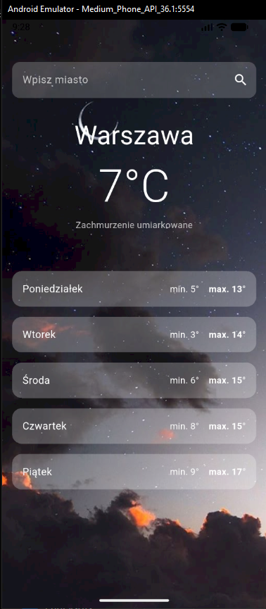

# 📱 Zadanie – Aplikacja Flutter

Projekt aplikacji mobilnej wykonany we Flutterze w ramach zadania.

## 📌 Opis projektu

Aplikacja mobilna stworzona w celu nauki:
- pracy z Flutterem
- struktury projektu
- pracy z Git i GitHub
- budowania aplikacji od zera

## 🚀 Technologie

- Flutter
- Dart
- Git
- GitHub

## 📂 Struktura projektu

- `lib/` – główny kod aplikacji
- `android/` – konfiguracja Android
- `ios/` – konfiguracja iOS
- `pubspec.yaml` – zależności projektu

## 📢 AKTUALIZACJE

- *27.02.2026* - rozpoczęcie budowy apki pod API i wdrażanie pomysłu apki pogodowej
## Screenshot aplikacji
